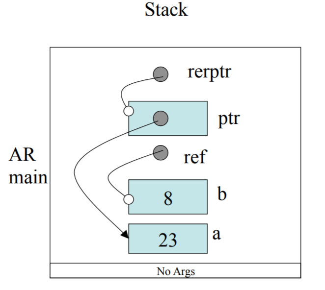

# ENSF 480 Final Exam

## Data Modelling

Data modelling is the process used to define and analyze data requirements needed to support business processes within the scope of corresponding information systems of organizations. In other words, its used to help design the data systems needed by a company.

This can be broken into three stages:

### Early Analysis Stage
Conceptual Data Model
* A set of technology independent specifications about data
* Used to discuss initial data requirements with business stakeholders

### Early Design Stage
Logical Data Model
* Translation of conceptual data model into logical model
* Documents the structure of the data that can be implemented

### Late Design Stage
Physical Data Model
* Translation of logical model to database table

Usually, a conceptual data model is a DFD (Data Flow Diagram) model. This does not show the natural "structure of the data"

That's where the ERD (Entity Relationship Diagram) comes in.

A ERD is good for quickly obtaining information about the structure of a system's database.

## Entity
A entity is a abstract concept within a data model. Each representing one or more instances. Each entity is represented by a box and a singular name. The following a way to properly model out a data structure:

1. Identify the domain entities. 
2. Identify whether or not the terminator information needs to be accessed.
3. Analyze each entity. Is it a composite entity? If so, then it has a 'many cardinality' associated with it.
4. Identify the relationship between entities.
5. Identify the type of relationship.
6. Identify the multiplicity among the entities. 
7. Identify the optionality among the entities relationships. (Whether its mandatory).

## Data Dictionary

A listing of all the data elements, and organized alphabetically. It describes each data element in a precise, rigorous manner. It describes the following:
* Meaning of all data flows and data stores
* Composition of data flows
* Composition of stored data

It specifies the values and units of data, and helps define the relationship between data stores in conjunction with the ERD.

Here are a couple fields in a Data Dictionary:
* Name: Primary name of the composite data item
* Aliases: other names for the data item
* Where used: data transforms that use the composite data item
* How used: the role of the data item
* Description: a notation for representing data
* Format: specific information about data types


## Software Process Models

The Software Development Process or Software Development Life Cycle is splitting of software development activities into different phases.

A example would be going from: Analysis -> Design -> Code -> Test

Pros:
* Simple
* Independency of phases
* Suitable for smaller projects

Cons: 
* No output until end
* Hard to manage requirement changes
* High degree of uncertainty and risk
* Not suitable for large projects

### Iterative Models

Pros:
* Early working product
* Easier to manage the requirement changes
* Easier for testing and debugging
* Lower risk factor

A example would be going from: Design -> Implement -> Analysis -> Design -> Implement -> Analysis ....

### Spiral Model

Pros and Cons:
* Same as simple linear models, with focus on risk analysis

## Prototyping

* Prototyping can improve the quality of requirements and specifications provided to developers. It can help reduce cost of requirement as errors will be detected earlier.

## Agile Development

1. The highest priority of the Agile Development Cycle is to satisfy the customer through early and continous delivery of valuable software. 
2. Welcoming changing requriements, even late in development, Agile Development harnesses change for customer's competitive advantage
3. Deliver working software frequently, from a couple of weeks to a couple of months
4. Business people and developers must work together daily throughout the project
5. Build projects around motivated individuals. Give them the environment and support they need.
6. The most efficient way of conveying information is face-to-face
7. Working software is the primary measure of progress
8. Agile processes promote sustainable development. Sponsors, developers, and users should be able to maintain a constant pace indefinitely.
9. Continous attention of technical excellence and good design enhances agility.
10. Simplicity - the art of maximizing the amount of work done is essential
11. The best architecture emerges from self-organizing teams
12. At regular intervals, the team reflects on how to become more effective

### SCRUM

1. 15 minutes every day, talk about what have I done, what do I need to do, and how will I do them? 
2. Every couple of weeks, release working software, review of requirements "backlog"

## Testing Approaches

1. V-Model (Waterfall Approach)

From my understanding, you pretty much plan and design everything first, and then implement all at once. Then you integrate, test, and verify, and go back to designing if need be. 

2. Test-Driven Development

Test-Driven development, as the name suggests, mean you design a small piece of code, implement it, test it (using J-Unit), and progressively add on to it by further producing code and testing.

## Rapid Application Development (RAD) Approach

This approach aims to:
* produce high quality systems quickly, primarily via incremental and iterative evolutionary prototyping.
* Using development tools like: GUI builders, CASE tools, and Database Management System (DBMS).
* Intensively involves the user
* Controls the project control using "timeboxes". If the project starts to slip, emphasis is to reduce requirements to fit the timebox, not increase the deadline
* Use Joint Application Design (JAD) approach

## Rational Unified Development Process (RUP)

The rational unified process is structured along two dimensions:
* Process components: Production of a specific set of artifacts with well-defined activities
* Time: Division of the life cycle into phases in iterations

Both dimensions must be taken into account for a project to succeed.

The Process Component Dimension includes the following activities: Requirement, Analysis, Design, Implementation, and Testing.


Basically, the difference between Agile & Unified Process Development is that Unified Process Development more or less stays somewhat true to the Waterfall method. It still goes in a somewhat linear fashion - A Inception -> Elaboration -> Construction -> Transition phase. These phases follow the Design -> Implement -> Test pattern, which is what the Waterfall method basically is. However, it tries to have small elements of previous phases in each step (so in construction, you still be doing a bit of planning), which is unlike Waterfall, where everything is more rigid and each process should only involve itself.

Agile, on the other-hand, has iterations that involves all steps of the (design->implement->test) cycle. Its goal is to produce working software over documentation. In each iteration, you'll be creating software (small parts of the entire picture) and following all the steps of the development cycle. You'll present your work to your co-workers and clients, and once that iteration is complete, you'll rapidly move to the next iteration. The goal of the Agile Development Cycle is to produce working software as quickly as possible, to fit changing user requirements and minimize risk as much as possible.
  
Finally, Rapid Application Development is basically a form of Agile Software Development methodology. It emphasizes working software and user feedback over strict planning and requirements recording. It essentially emphasizes a lot more testing. Below are the steps:

1. Figure out the requirements - Get to know all the requirements, constraints and what you need to build.
2. Build prototypes, like crazy!! Build and improve on these prototypes.
3. Get user feedback!
4. Do it again! Continuing prototyping, testing until the clients requirements are met.


## Review

* Drawing AR Diagrams

```cpp
int main() {
    int a, b;
    int& ref = b;
    int *ptr = &al
    int * &refptr = ptr;
    *ptr = 4;
    ref = 8;
    *refptr = 23;
}
```

The resulting memory diagram is below:



I don't think that there will be a large focus on C++ concepts and ideas on the final, but here is the broad strokes of all the pre-midterm material.

### Copying Objects

You can initialize a different instance of a class with a particular instance as follows:

```cpp
Aclass a1;
Aclass a2 = a1; // Initialization
Aclass a3;
a1 = a3; // Assignment
```

Every data member of the instance a1 will be copied into instance a2.

You need a Copy Constructor to allow for Initialization by 'copying' as follows:

```cpp
String::String(const String& s) {
    len = s.len;
    str = new char[len+1];
    assert(str!=0);
    strcpy(str,s.str);
}
```

An assignment operator is needed for assigning a instance of an object to another that has already been initialized.

```cpp

String& String::operator=(String& s) {
    if(this != &s) {
        delete[] str;
        len = s.len;
        str = new char[len+1];
        strcpy(str,S.str);
    }
    return *this;
}

```

C++ functions also may have default arguments. The right most not initialized argument must be supplied with a default initializer before any on the left can be supplied.

### Four Pillars of Object Oriented Design

* Abstraction
* Encapsulation
* Modularity
* Heirarchy

Abstraction is the idea that we should base all of our implementation off abstractions - simplified models of complex systems. In abstractions, the inessential details are ignored. In the context of OOP (Object Oriented Programming), Abstraction is in regards to class data types.

Encapsulation is in regards to keeping data hidden in classes and invisible to other classes. The point of doing this is to reduce coupling between objects.

Modularity is the property of a system being decomposed into a set of cohesive and loosely coupled modules. A class/object would be the lowest level of modularity. Higher levels is in regards to physical containers which the classes and objects are placed.

Hierarchy, is the use of inheritance, abstraction, etc. The importance of hierarchy is particularly helpful when developing complicated structures, by keeping everything organized.

### Friend classes in C++

The following can be 'friends' to a class:

* A global function, visible to a class.
* A member function of other classes in the program, visible to the class.
* Another class, that is visible to the class.

How are they declared?

```cpp
void f();

class A {
        int a;
        friend void f();
    
    public:
        A();
        void print();
}
```

### Static Members in C++

A static class member acts as a global object among the objects of the same class. Information hiding can still be enforced (private static is a thing). A static data member is initialized outside the class definition, and can be constant or a class object.

For example, please see the following:

```cpp
class foo {
    private:
        static int i;
};
```
That would be a static private variable. To initialize it:

```cpp
int foo::i = 0;
```

### Overloading Operators in C++ 

A class designer can provide a specific set of operators to work with the objects of the class. This is achieved by defining an operator function. An operator doesn't need to be a member function, but must take at least one class argument. This prevents the programmer from overloading the behaviour of operators for built-in data types.

It's important to note that an operator function should not change the nature of an operator. For example, the overloaded operator function cannot convert an unary operator to a binary operator, etc. 

Let's work on overloading the + operator for a string class.

Header file:
```cpp
class String {
    public:
        ...
        String operator+(const String& s);
    private:
        char *storageM;
        int length;
};
```

CPP file:
```cpp
String String::operator+(const String& s) {
    String temp;
    temp.length = length + s.length;
    delete[] temp.storageM;
    temp.storageM = new char[temp.length +1];
    strcpy(temp.storageM, storageM);
    strcat(temp.storageM, s.storageM);
    return temp;
}
```
 ### Member and Non-Member functions

 If the first parameter of an overloaded function is an object of another class, the function must be a nonmember function. However, if it needs access to the data members, it needs to be a friend.

 By definition, the assignment '=','[]', '()', and '->' are required to be class members.

 ### Type Conversion

 ```cpp
 String::String (int len) {
     storageM = new char[len+1];
 }
 ```
Constructors with only one argument can act as implicit type conversion to convert a given argument to the type of the class.

### Overloading the postfix and prefix operators

```cpp
class String {
    public:
        String();
        String(char *s);
        ...
    private:
        char* cursorM;
        char* storageM;
        int length;
}

//postfix
char String::operator++(int) {
    char ret = *cursorM;
    cursorM++;
    return ret;
}

//prefix
char String::operator++() {
    cursorM++;
    return *cursorM;
}
```

