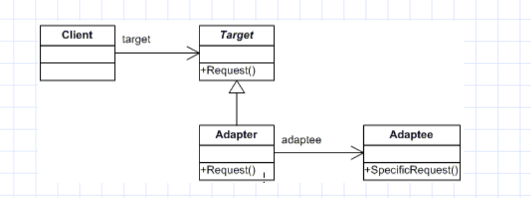
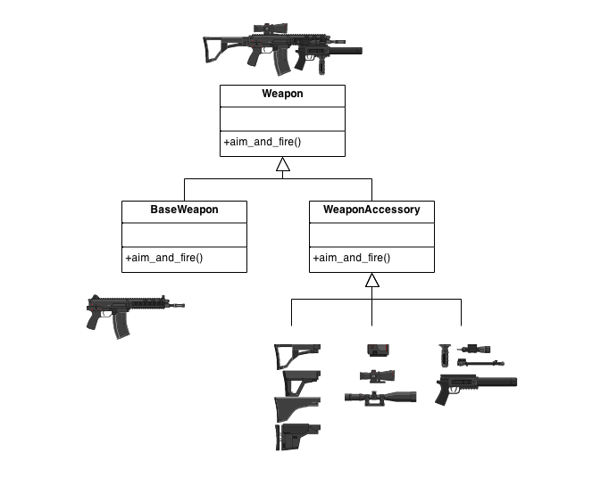
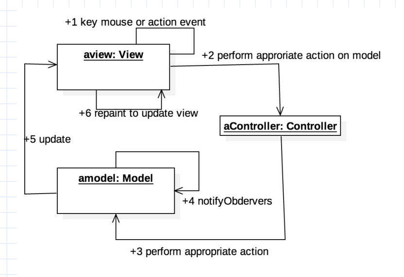

# ENSF 480: All the Design Patterns
When building any sort of application, requirements always change. In the industry, clients always have ever changing needs that need to be satisfied as quickly and effectively as possible.

The objective of using design patterns is to create a standardized and "baseline" to how we can combat changing needs over time. These design patterns represent what the industry considers to be "best practices" used by experienced OOP developers.

The Gang of Four is four people (Gamma, Helm, Johnson and Vlissides) who compiled a catalog of design patterns, which can be read in the book *Design Patterns: Elements of Reusable Object-Oriented Software*. 

There are several types of design patterns.

Let's start with Creational Patterns.

## Creational Patterns
Creational Patterns provide a way to create objects while hiding the creation logic. This prevents programmers from instantiating objects directly using the constructor.

In many ways, we've already been doing this in our classes already.

### Abstract Factory
The Abstract Factory design pattern allows us to produce a family of objects without directly specifying their concrete classes. It takes advantage of abstract and class hierarchy in Java.

Basically, Abstract Factory allows us to create a large "family" of objects. We can decide which objects from this "family" can be selected quite easily. Another goal of Abstract Factory is to separate the construction of objects from their implementation as much as possible. This means separating their classes and ensuring that they rely on each other as less as possible.


If we take a look at this photo, we can see that the client is loosely coupled with the Factory Products. While it has a AbstractFactory, it isn't involved with each individual factory or how each product is created. The important thing to note is that the client is decoupled from the concrete classes.

Here's an example.

Suppose you're trying to build a small GUI application. You want your application to work on both Android and Mac. You want the decouple the implementation of each individual GUI from the client as much as possible. You also want to create a family of objects.

On the client, thanks to polymorphism and Java OOP, the client will be as less involved in the creation of the GUI as much as possible.

```Java
    public static void main(String[] args) {
        Application application;
        application = new AndroidApplication();
        application.createGUIApplication();
        application = new MacApplication();
        application.createGUIApplication();
    }
```
In the client (main), we can clearly see that the client has no idea how the Android GUI is being implemented or the MAC GUI implementation. It just creates an application, and has the option of choosing Mac or Android. As mentioned before, this decouples the client and implementation as much as possible. Therefore, we can easily change which application we want to build at runtime (Android or Mac), while allowing us to create a large family of objects.

Since we don't want application to be instantiated on its own (cause what will a application be without Android or Mac!?), we will make application an abstract class.

```Java
abstract class Application {
    GuiFactory guiFactory;
    abstract void createGUIApplication();
}
```

The classes that extend Application will have the opportunity to decide whether an Android or Mac Application is developed.

```Java
class MacApplication extends Application {
    public MacApplication() {
        guiFactory = new MacGuiFactory();
    }

    public void createGuiApplication() {
        guiFactory.createButton("Mac Button");
        guiFactory.createMenu();
    }
}

class AndroidApplication extends Application {
    public AndroidApplication() {
        guiFactory = new AndroidGuiFactory();
    }

    public void createGuiApplication() {
        guiFactory.createButton("Android Button");
        guiFactory.createMenu();
    }
}
```

Each application has a GUI factory. The guiFactory itself is an interface to let the client decide which type of app to implement.

```Java
    interface guiFactory {
        public Button createButton(String label);
        public Menu createMenu();
    }

    class AndroidGuiFactory implements GuiFactory {
        Button b;
        Menu m;
        Scrollbar s;

        public Button createButton(String label) {
            b = new AndroidButton(label);
            return b;
        }

        public Menu createMenu() {
            m = new AndroidMenu();
            return Menu;
        }
    }

    class MacGuiFActory implements GuiFactory {
        Button b;
        Menu m;
        Scrollbar s;

        public Button createButton(String label) {
            b = new MacBUtton(label);
            return b;
        }

        public Menu createMenu() {
            m = new MacMenu();
            return Menu;
        }
    }   
```

Inside the Button and Menu classes, we've have implementation of Android Menus and Mac Menus.

If we consider what a Creational Pattern is again, we recall that a creational pattern allows us to create objects while hiding the implementation logic.

The abstract factory design pattern does just that. 

In the example above, the client has access to an application.

* The Application has a guiFactory that makes the application. 
* Depending on what the client wanted, we were able to make a Mac application or Android Application.

This was all done thanks to OOP principles (hierarchy, inheritance, abstraction).

The advantages of this are:
1. We can create different families of objects that can be selected and changed dynamically. (We can easily add a Linux Application and the client wouldn't even know it). This way, the system is completely independent of how its objects are created.
2. We can easily modify the creation code (menu, etc.) without the client knowing that is being changed.
3. This also makes unit testing easier. Less coupling.

## Structural Patterns
Let's touch on structural patterns now.

Structural patterns concern class and object composition.

This includes Adapter, Bridge, and Decorator Pattern.

### Adapter Pattern
Adapter pattern is fairly straightforward to understand. Basically, you're trying to 'adapt' an existing interface to fit the needs of the client. 

Imagine you want to implement a pre-existing interface on one of your classes. The classes are similar, but there are several features that make these classes incompatible.

The purpose of the Adapter Design Pattern is to overcome this problem.



There are several different "players" in this solution.

1. The target is the current domain-specific interface that the client likes. This is the interface you're targeting to change.
2. The client is the class that currently works with the interface "Target".
3. The adaptee is the class that wants to use the Target Interface - but needs an "adapter" to slightly change it so that it can use the interface.

Suppose you have several legacy (old) classes as shown below.

```Java
class Line {
    public void display(int x1, int y1, int x2, int y2) {
        System.out.println("The coords of the line are" + x1 + "," + y1 + " and " + x2 + "," + y2);
    }
}
```

You also have a pre-existing interface that is *similar* to what class Line wants. Similar in the fact that class Line can implement it, but needs slight changes. Please take a look at the interface below.

```Java
interface Target {
    void display(int x, int y, int x, int w, String color);
}
```
It is plainly written that the Target interface takes in a color parameter that class Line does not have. Without directly modifying class Line or interface Target, we can create an "intermediate" adapter class that mends the differences between the two classes.

That's where an adapter comes in. We can create a LineAdapter class that implements the Target interface and have it fit the line needs.

```Java
class LineAdapter implements Target {
    private Line adaptee;

    public LineAdapter(Line line) {
        adaptee = line;
    }

    public void display(int x1, int y1, int x2, int y2, String color) {
        adaptee.display(x1, y1, x2, y2);
        System.out.println("And its color is..." + color);
    }
}
```

### Decorator Pattern

The Decorator Pattern is another Structural Pattern with the goal of attaching additional responsibilities to an object dynamically. It provides an alternative to subclassing. It's important to emphasize that the Decorator Pattern is for *individual* objects. You can customize individual objects, as the "Decorator" name suggests.

Often times, many extensions are needed for a class. If we were simply to subclass this pre-existing class, a great number of extensions would be needed. The goal of the Decorator Pattern is to alleviate the need for large number of subclasses.

Please consider the image below.



A decorator attaches additional responsibilities to a object dynamically. We have a base weapon that implements the interface Weapon. However, we also have the WeaponAccessory decorator that allows the user to customize their base weapon as they please.

Below is an example of how this can be implemented.

```Java
abstract class Decorator implements Weapon {
    Weapon weapon;
    public Decorator(Weapon weapon) {
        this.weapon = weapon;
    }
}
```

The reason why we have a weapon data member present in the Decorator class is to allow us to maintain the pre-existing object when adding a Decorator object. This is better explained after we implement some more code:

```Java
class WeaponFeature extends Decorator {
    private String color;

    public WeaponFeature(Weapon weapon, String color) {
        super(weapon);
        this.color = color;
    }

    @Override
    public void display() {
        weapon.display();
        System.out.println("The color of your weapon is" + color);
    }
}
```

Here is the interface and its immediate concrete Component:

```Java
interface Weapon {
    void display();
}

class BaseWeapon extends Weapon {
    private String name;

    public Weapon(String name) {
        this.name = name;
    }

    void display() {
        System.out.println("The name of this weapon is " + name);
    }
}
```
Consider the fact that we only wanted a base weapon. We will initialize it as the following:

```Java
public void main(String[] args) {
    Weapon myWeapon = new BaseWeapon("Sword");
}
```

Here, we have created a base weapon called Sword. There is nothing special about this particular object. 

Suppose we want to add a *specific* color to this *specific* Sword. Then, we can use the features of the Decorator Design Pattern to only add a color to this particular sword.

```Java
public void main(String[] args) {
    Weapon myWeapon = new BaseWeapon("Sword");
    myWeapon = new WeaponFeature(myWeapon, "Blue");
    t.display();
}
```

Now you can see why we're passing in a myWeapon parameter into this new WeaponFeature object. This ensures that the base weapon object is maintained, while we can add the additional color feature to this object.

1. The Decorator Pattern provides a flexible alternative to subclassing for extended functionality.
2. Allows for modification at runtime as opposed to compilation.
3. You can always add more Decorator subclasses with any particular combination to the particular object.
4. This pattern consolidates the idea of "Closed for modification, but open for extension". You can always extend a particular feature (the decorator subclasses), without modifying the concrete component.

### Bridge Pattern
Let's review the Bridge Pattern now.

The goal of the Bridge Pattern is to separate the abstraction from the implementation. The important idea is that we make the functionality of the concrete classes independent from the interface implementers.


Basically, Bridge Pattern uses the idea of "prefer Composition over Inheritance".

Check out the example below.

Imagine you have a shape interface. There are different types of shapes, like Circle, Rectangle, etc..

But there are also different colors of Shapes. Red Rectangle, Blue Rectangle, Blue Circle, etc...

If we were to approach this problem simply using inheritance, we would have a Shape class, subclassed into Rectangle and Circle, which is further subclassed into BlueRectangle, RedRectangle, etc.

This would get really messy real quick. The goal of Bridge is to basically separate the abstractions (color) from the implementations (shapes). This way, we won't need to be concerned about all the different combinations of shapes and colors. They will be separately implemented and called.

Here is another implementation of the Bridge pattern, using TV's and remotes.

```Java
interface TV {
    public void on();
    public void off();
    public void tuneChannel(int channel);
}

class Sony implements TV {
    public void on() {
        System.out.println("SONY is on!");
    }

    public void off() {
        System.out.println("SONY is off!");
    }

    public void tuneChannel(int Channel) {
        System.out.println("Current channel is " + Channel);
    }
}

class Samsung implements TV {
    public void on() {
        System.out.println("SAMSUNG is on!");
    }

    public void off() {
        System.out.println("SAMSUNG is off!");
    }

    public void tuneChannel(int Channel) {
        System.out.println("Current channel is " + Channel);
    }
}
```

Here, we have two different brands of TV, Samsung and Sony. With every TV, we can pair up a different brand of remote.

```Java
abstract class RemoteControl {
    protected TV implementor;
    public RemoteControl(TV imp) {
        implementor = imp;
    }

    public void on() {implementor.on();}
    public void off() {implementor.off()};
    public void setChannel(int Channel) {implementor.tuneChannel(channel);}
}

class TelusRemote extends RemoteControl {
    private int currentChannel;

    public TelusRemote(TV imp) {
        super(imp);
    }

    public void nextChannel() {
        currentChannel++;
        setChannel(currentChannel);
    }
}
```

By separating the abstractions from the concrete implementations, we can pair up any sort of permutation of TV and remote control. Imagine a TelusRemote had a special feature that a ShawRemote didn't? Rather than have inheritance were we have a SonyTVwithShawRemote class, SamsungTVwithTelusRemote class, or SonyTVwithTelusRemote class (where we basically create a class for every permutation), we can separate the abstractions and the implementations to make everything easier.

Below shows a quick way to run all of this.

```Java
public static void main(String[] args) {
    TV Sony = new Sony();

    RemoteControl telusRemote = new TelusRemote(Sony);
    telusRemote.on();
    telusRemote.setChannel(50);
    telusRemote.off();
}
```

## Behavioural Patterns

Behaviour patterns are largely concerned about communication between objects.

Examples of Behavioural patterns would be Strategy pattern and Observer patterns. Let's touch on those now.

### Strategy Pattern

The purpose of the Strategy pattern is to allow users to easily change the behaviour of a particular context.

For example, if you had a particular Animal class that allows an animal to move - the strategy pattern will enable the animal to move in a variety of ways.


When developing an application that utilizes the Strategy pattern, we must approach this as show below:
1. Identify each changeable behaviour (like how an animal moves, etc.)
2. Create an interface for each behaviour
3. Create classes that implement that interface (like if its a moving interface, the classes can create walk, run, jog, etc.).

Each strategy implements one behaviour. This allows the object to change its behaviour dynamically without changing the class itself(again, closed for modification, open for extension!).

```Java
class Context {
    Strategy str;
    public Context() {
        //set Strategy here
        //initialize all necessary data members
    }

    /**
    * sets the strategy. This strategy is one of the identified changeable behaviours.
    */
    public void setStrategy1(Strategy s) {
        str = s;
    }

    /**
    * Perform the desired strategy.
    */
    public void performStrategy1() {
        str.performStrategy();
    }
}

interface Strategy {
    public void performStrategy();
}

class Strategy1 implements Strategy {
    public void performStrategy() {
        //implement that strategy.
    }
}
```

Here are the benefits of the Strategy patterns:
1. This makes a reusable family of algorithms
2. Way better than subclassing - Changeable behaviours are not hardwired.
3. Cleaner code
4. Provide different implementation of same behaviour.

### Observer Pattern

The Observer Pattern is similar to the MVC Model in many ways. The Observer Pattern allows the creation of objects whose state can be watched.



As you can see, the controller listens to the View (once any change in the view is detected, the controller will respond as necessary). The model listens to the Controller (the controller changes will notify the model to make necessary changes). And any update to the model will be reflected in the view.

Here are a couple important terms:
* Observer - An object that "watches" the state of another object and takes action when the state changes right away.
* Observable Object - An object that allows observers to examine it


In the example above, the JobSeeker observers the HeadHunter. Once the HeadHunter finds a job, the JobSeeker will be notified and take the necessary actions.

Here are the implementation steps:
1. Create an observer interface with an update method. This update method is important as it updates the observer classes about any changes
2. Create a interface/abstract class that contains methods for the "observee" that contains add or remove observer object.
3. Create a class that implements the subject (the step 3).
4. Create one or more classes that implements Observer.

The following is an example:

Step 1:

```Java
public interface Observer {
    public void update(double data);
}
```

Step 2:

```Java
public interface Subject {
    public void register(Observer o);
    public void remove(Observer o);
    public void notifyObserver();
}
```

Step 3:

```Java
class Weather implements Subject {
    private double temp;
    private ArrayList<Observer> observers;

    public Weather(double t) {
        observers = new ArrayList<>();
        temp = t;
    }

    public void register(Observer o) {
        observers.add(o);
        o.update(temp);
    }

    public void remove(Observer o) {
        observers.remove(o);
    }

    public void notifyObservers() {
        for(Observer currObserver: observers) {
            currObserver.update(temp);
        }
    }

    public double getTemp() {
        return temp;
    }

    public void setTemp(double t) {
        temp = t;
        notifyObserver();
    }
}
```

Step 4:

```Java
class HorizontalDisplay implements Observer {
    double temp;
    Subject weather;

    public HorizontalDisplay(Subject w) {
        weather = w;
        weather.register(this);
    }

    public void update(double temp) {
        this.temp = temp;
        display();
    }

    public void display() {
        // display weather horizontally
    }
}
```
Step 5:

```Java
public static void main(Strings[] args) {
    Weather w = new Weather(50);
    HorizontalDisplay horz = new HorizontalDisplay(w);
    w.setTemp(55);
    //the observers will be notified
    horz.display();
}
```

The benefit with Observer is that it supports loose coupling between objects that interact with each other. You can easily send data to other objects without changing the Subject and Observer classes.

The relationship is created at runtime, which means a particular observer can be added or remove at the users will.