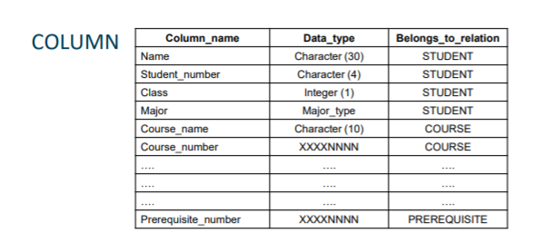
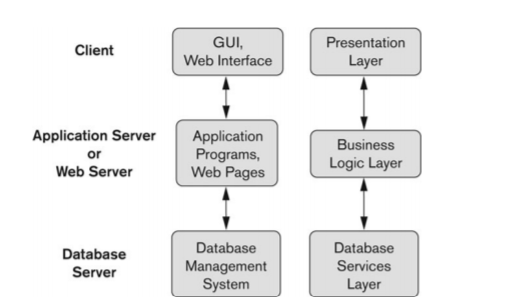

# CPSC 471: Databases

A database is a collection of related data. Data itself is known facts that can be recorded and have a implicit meaning.

When analyzing databases, we can categorize them into different types:

## Traditional Applications
* Numeric and Textual Databases
## More Recent Applications
* Multimedia Databases
* Geographic Information Systems (GIS)
* Biological and Genome Databases
* Data Warehouses
* Mobile databases
* Real-time and Active databases

Here are some basic definitions regarding databases:
* Mini-World: Some part of the real world about which data is stored in a database
* Database Management System: A software package/system to facilitate the creation and maintenance of a computerized database
* Database System: The DBMS software together with the data itself. Sometimes, the applications are also included.

On other words, a database has some source from which data is derived, some degree of interaction with events in real world, and an audience that is actively interested in its contents. A database amangement system is a computerized system that enables users to create and maintain a database.

## Typical DBMS Functionality

1. Define a particular database in terms of its data types, structures, and constraints
2. Populate(Construct) the initial database contents on some storage medium
3. Manipulating the database involves retrieving information, and modifying information
4. Processing and sharing by a set of concurrent users and application programs - yet, keeping all data valid and consistent

Applications can interact with a database in different ways. They are noted below.

1. Queries: Typically used to retrieve data from a database. Some may use for other types of requests including modifying the data. It represents a single request.
2. Transactions: Executes group of SQL statements that have the ACID property.

This includes:
* Atomicity: All statements or none are executed
* COnsistency: Data integrity is maintained.
* Isolation: Transaction A can never affect transaction B
* Durability: Changes that are committed by a transaction persist, even in the event of system failure

DBMS should also have protection and security measures to prevent unauthorized access. "Active" processing to take internal actions on data. It should present and visualize data in a good way.

The main characteristics of the database approach is to:

1. Provide insulation between programs and data, called program-data independence. Allows changing data structures and storage organization without having to change the DBMS access programs.

2. Data abstraction: A data model is used to hide storage details and present users with a conceptual view of database.

3. Support multiple views of the data: Each user may see a different view of the database, which describes only the data of interest to the user. 

4. Sharing of data and multi-user transaction processing: This means support for concurrent users and concurrency control. 

When categorizing the database users. users may be divided into:
* Those two actually use and control the database content, those who design, develop and maintain database applications ("ACTORS")
* Those who design and develop the DBMS software and related tools ("WORKERS")

Here are some of the advantages of using the database approach:

* Controlling redundancy - allows sharing of data
* Restricting unauthorized access
* Persistent storage
* Storage structures
* Provide optimization of queries for effificent processing
* Providing backup and recovery
* Multiple interfaces to different classes of users
* Standards on enforcing data types/names, etc.
* Reduced development time
* Flexibility to change data structures
* Availability of current information

### Data Models

A data model is a set of concepts to describe the structure of a database, the operations for manipulating these structures, and certain constraints that the database should obey.

A data model structure and constraint is used to define the database structure, which includes elements, relationships, etc.

Data Model operations are database retrievals and updates.

There are different categories of data models.

* Conceptual data models (Provide concepts that are close to the way that many users perceive data)
* Physical data models (Provide concepts that describe details of how data is stored through the comptuer)
* Implementation data models (Provide concepts that fall between the above two)
* Self-describing data models (Combine the description of data with data values)

## Schemas vs Instances

A schema is the description of a database. It is a database structure, data types and constraints.

The database instance is the actual stored data at a particular point in time. 

The database state is split into three parts:
* Database state (content of a database at a moment in time)
* Initial database state (database state initially loaded in)
* valid state (state that satisfies the structure and constraint of the database)

Database schema is split into three levels:
* Internal schema describes the physical storage structures and access paths
* Conceptual schema describes the structure and constraints for the whole database for a community of structures
* External schema at the external to describe the various user views

You can commonly refer a Schema as a intension, and a state as a extension. A schema can be simply visualized as the table headers in a table. A state includes all the rows of data in the table.

A external level schema would be a ERD or something (interpretable by a non-computer science major).

## DBMS Languages

* DDL - Create the schema (conceptual)
* DML - manipulate the data 

### Three-Tier Client-Server Architecture

## Entity Relationship Diagram

The UML Class Diagrams are popular in industry to document conceptual database designs.

### Concepts

* Entities are specific things or objects in the mini-world that are represented in the database

* Attributes are properties used to describe the entity.

A specific entity will have a value for each of its attributes. Each attribute has a value set associated with it (intege, string, date) ...

### Types of Attributes

* Simple (Atomic) - Each entity has a single atomic value for the attribute. For example, age or sex.

* Composite - The attribute can be divided into subpart. For example, a Address may be divided into subparts. The composition may form a hierarchy, where some components are composite.

### Single-Valued vs Multi-valued

* Multi-valued is when a entity has multiple values for an attribute. 
* In general, composite and multi-valued attributes may be nested artibrarily to any number of levels.

### Stored vs Derived Attributes

* Derived Values - Attributes whose value are derived from other values.

* Fixed Values - Attributes whose value are not derived from other ones

### Entity Types and Key Attributes

* Entity type define a collection of entities with the same attributes
* An attribute for an entity type for which each entity must have a unique value is called key attribute

## Entity Relationship Diagrams

## Entity Types and Key Attributes

* Entity types define a collection of entities with the same attributes
    * For example, EMPLOYEE and PROJECT
* An attribute of an entity type for which each entity must have a unique value is called key attribute
    * For example, SSN of EMPLOYEE

It is important to note that:
* A key attribute must be composite (VehicleTagNumber is a key for the CAR entity, Number & State)
* AN entity type may have more than one key (VIN number and VehicleTagNumber)

## Entity Set

* Each entity type has a collection of entities stored in the database
    * called the entity set or sometimes entity collection
* Entity set is the current state of entiries of that type that are stored in the database

## Value Sets (Domains) of Attributes

Each simple attribute is associated with a value set.

* A value set specifies the set of values associated with an attribute
* Value sets are not displayed in ER diagrams

* Value sets are similar to data types in most programming languages - eg. integer

## Relationships

* A relationship relates two or more distinct entities with a specific meaning
    * EMPLOYEE John Smith works on the ProductX Project
    * EMPLOYEE Franklin Wong manages the research DEPARTMENT
* Relationships of the same type are grouped or typed into a relationship type
    * the WORKS_ON relationship type in which EMPLOYEES and PROJECTS participate
    * MANAGES relationship type in which EMPLOYEES and DEPARTMENTS participate
* The degree of a relationship type is the number of participating entity types
    * both MANAGERS and WORKS_ON are binary relationships
    * We can also have ternary relationships - many to many relationships

## Relationship Type vs Relationship Set
* Relationship Type:
    * Is the schema description of a relationship
    * Indentifies the relationship name and the participating entity types
    * Also defines relationship constraints
* Relationship Set:

## Enhanced Entity Relationship
### Subclass vs superclass

* A entity may have subgroups that need to be represented because of their significance to the database. For example, a Employee entity may have subgroups SECRETARY, ENGINEER, MANAGER, TECHNICIAN, etc
* When going from superclass to subclass, its called specialization
* When going from subclass to superclass, its called generalization

### Cardinality Ratios
* One-to-one (1:1)
* One-to-many (1:N)
* Many-to-One (N:1)
* Many-to-Many (M:N)

## Participation

* In total participation, where every entity in participates - double line 
* In partial participation, where not all entity needs to participate - single line

## Disjointness

* Disjoin specialization/generalizations
    * Entities of subclasses of the same superclass are mutually exclusive
* In the case of overlap, we use overlap specialization/generalizations

## Categories
* Union - can only appear in one of the entities
    * Denoted by symbol U
* Category vs Intersection
    * Intersection - Entity needs to appear in every superclass
    * Category - Entity need to appear in at least one superclass

## Relational Models

Preclass discussion (about ERDs and EERDs):
* In a ERD, when we have a subclass, we can neglect it if it's not being used significantly. 
* A entity should have an attribute. If not, state it in the assumption.
* A entity may have multiple key attributes
* A partial key can be a combination of all the attributes of the superclass

Know your tutorial number for Wednesday's class. Today is an introduction to relational models.

The relation model of Data is based on the concept of a relation.

A relation is basically an entity (like a table). In the table is called attributes. The column describes the data being stored in that column. The rows are called tuples, entity instances, rows (all have the same meaning). 

Each relation should have a key attribute. This is where each tuple is unique. 

A set is an unordered collection of unique elements. A multiset is an unordered collection of elements. 

We can also represent relations mathematically. Look at the slides on how to do that.

A schema of a relation is denoted by R(A1,A2,A3...). A1,A2,..,AN are attributes. Each attribute has a domain or a set of valid values. For example, the domain of SSN is 9 digit numbers.

Each attribute should have a domain or datatype. A datatype could be boolean, integer, etc. The domain is the expected number to be stored there (basically how it's stored). A domain can be stored on the DBMS level or application level. 

A tuple is an ordered set of values, enclosed in angled brackets. You can think of it as ordered since the columns in the table are ordered. For example, a 4-tuple has 4 values.

The relation state is basically the set of tuples that match the relation schema (...I think). You can call them state. Having the same Relation State means that Relation state doesn't care about the order of data, as long as the same data is there.

Tuples typically are not considered to be ordered. Each attribute should have an atomic value. From what I'm understanding, I think he means that each column in a database table must be atomic (single value). Also, primary keys should never be null values.

Imagine we have a relation schema.

This is represented by:

Student(Name, Phone, Location). This whole thing is called relation schema.

Student is the Relation Name. The relation state is the set of tuples.

When looking at schema vs state, state is more about the data and schema is more bout the structure. The basic operations for changing the database:
* INSERT - New tuple added
* DELETE - Delete an existing tuple
* MODIFY - Modify an existing attribute in a existing tuple

